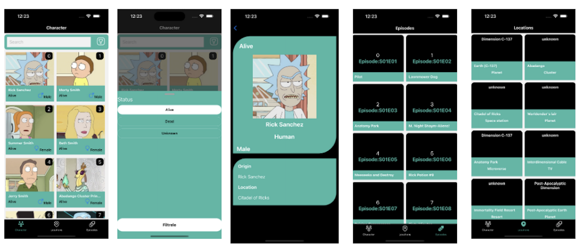

This is a new [**React Native**](https://reactnative.dev) project, bootstrapped using [`@react-native-community/cli`](https://github.com/react-native-community/cli).

# Library

> **Note**: Make sure you have completed the [React Native ](https://reactnative.dev/docs/environment-setup)
> **"@react-navigation/bottom-tabs"**
> **"@react-navigation/native"**
> **"@react-navigation/native-stack"**
> **"@react-navigation/stack"**
> **"axios"**
> **"iconsax-react-native"**
> **"react"**
> **"react-native":**
> **"react-native-fast-image":**
> **"react-native-gesture-bottom-sheet":**
> **"react-native-gesture-handler":**
> **"react-native-safe-area-context"**
> **"react-native-screens":**
> **"react-native-svg":**

# Getting Started

```bash
# using npm
npm start

# OR using Yarn
yarn start
```

## Proje Gif


